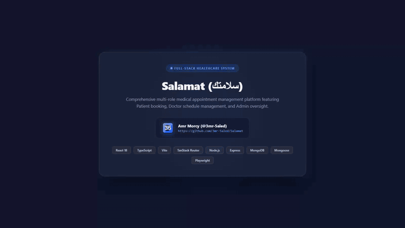
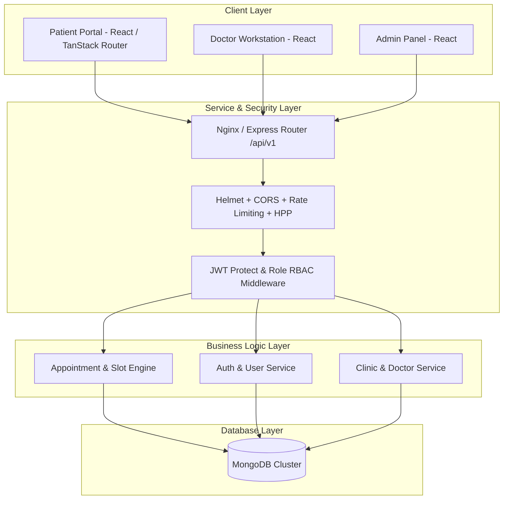
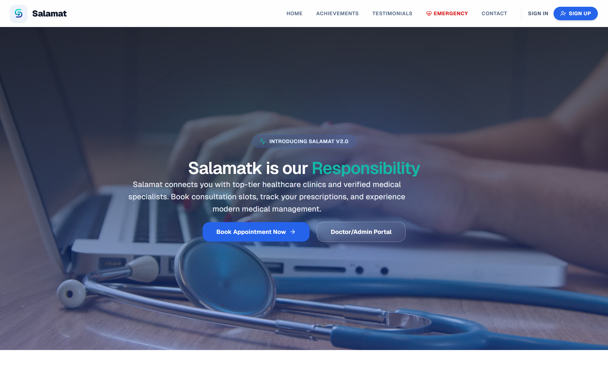
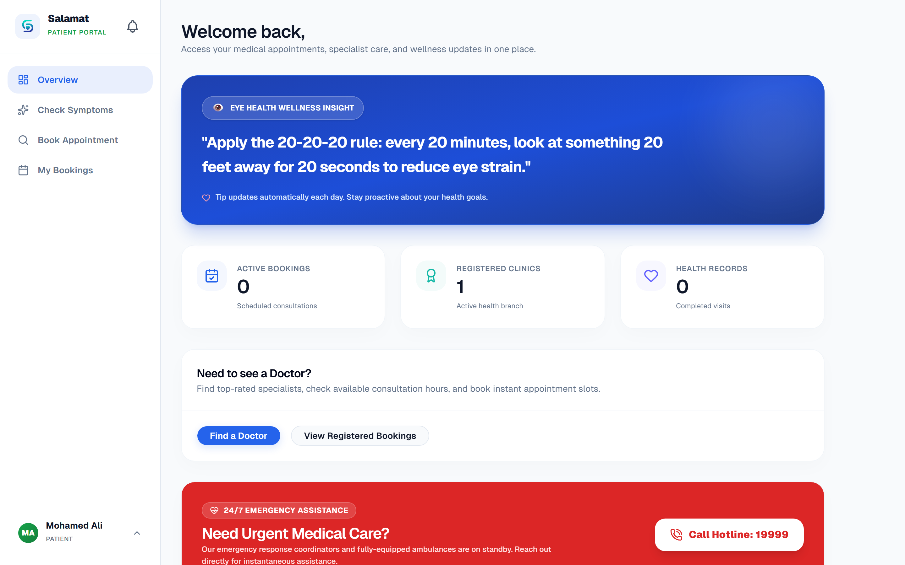
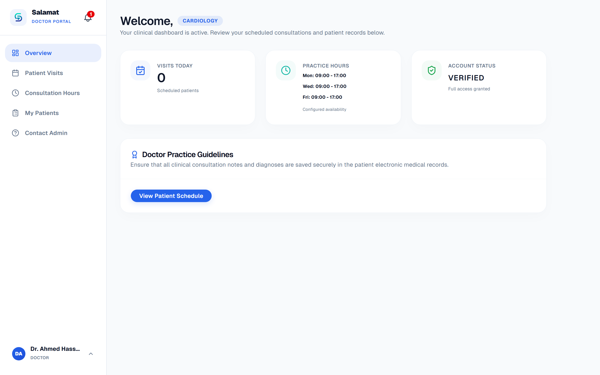
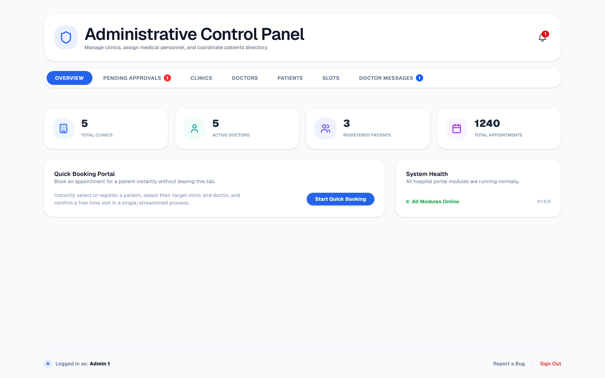

<div align="center">


# 🏥 Salamat Medical System

**An Enterprise-Grade, Full-Stack Healthcare Appointment & Clinical Management Ecosystem**

[](https://www.typescriptlang.org/)
[](https://reactjs.org/)
[](https://vitejs.dev/)
[](https://nodejs.org/)
[](https://expressjs.com/)
[](https://www.mongodb.com/)
[](docs/PRODUCTION_AUDIT_REPORT.md)

</div>

---

## 📌 Table of Contents

- [Overview](#-overview)
- [System Demo Video](#-system-demo-video)
- [System Architecture](#-system-architecture)
- [Key Features by User Role](#-key-features-by-user-role)
- [UI Screenshots](#-ui-screenshots)
- [OWASP Security & Hardening](#-owasp-security--hardening)
- [API Reference](#-api-reference)
- [Getting Started](#-getting-started)
- [Database Seeding](#-database-seeding)
- [Production Deployment](#-production-deployment)
- [License](#-license)

---

## 🌟 Overview

**Salamat** (سلامات) is a modern, full-stack medical appointment management platform engineered to connect patients with board-certified healthcare providers and hospital management.

Designed around a **3-tier role hierarchy** (`Patient`, `Doctor`, `Admin`), Salamat provides real-time specialist discovery, dynamic conflict-free slot scheduling, clinical consultation management, and paperless digital prescription rendering.

---

## 🎥 System Demo Video

<div align="center">



*Watch a full walkthrough of the Salamat Medical System including Patient booking, Doctor workstation, and Admin panel.*

</div>

---

## 🏗️ System Architecture



---

## 👥 Key Features by User Role

### 👨‍👩‍👧‍👦 1. Patient Portal
- **Specialty & Doctor Discovery**: Instant dynamic filtering by medical department and physician availability.
- **Smart Conflict-Free Booking**: Dynamic session time-offset algorithm preventing double bookings.
- **Digital Prescription Hub**: Authenticated view and print options for medical prescriptions powered by `<MedicalNotesDisplay />`.

### 📋 2. Doctor Workstation
- **Clinical Consultation Drawer**: Record clinical diagnosis, prescribe structured medications, and log internal records.
- **Shift & Hours Management**: Live schedule grid with instant emergency shift cancellation.
- **Direct Admin Inquiry**: Submit maintenance and clinic requests directly to hospital administration.

### 🛡️ 3. Admin Control Panel
- **Real-Time System Metrics**: High-level overview of total clinics, doctors, registered patients, and appointment metrics.
- **Facility Allocation**: Assign doctors to clinic rooms and manage walk-in patient registrations.
- **Medical Staff Messaging Inbox**: Centralized message management for doctor inquiries.

---

## 📸 UI Screenshots

<div align="center">

### 1. Landing Page & Ecosystem


### 2. Patient Portal & Booking Engine


### 3. Doctor Clinical Workstation


### 4. Admin Control Panel


</div>

---

## 🔒 OWASP Security & Hardening

Salamat implements strict security controls audited against **OWASP Top 10** standards:

| Control Area | Implementation |
|--------------|----------------|
| **HTTP Security Headers** | `helmet()` enabled for HSTS, Content Security Policy, and Frame Protection. |
| **Authentication & Auth** | JWT stateless bearer token validation with role-based guard middleware (`protect`, `allowedTo`). |
| **Password Storage** | Cryptographically salted hashes powered by `bcryptjs` (12 rounds). |
| **Rate Limiting** | `express-rate-limit` restricting IPs to 100 requests per 15-min window on API routes. |
| **Parameter Pollution** | `hpp` whitelist validation enforcing payload parameters. |
| **Data Sanitization** | `express-validator` schema validation and strict Mongoose schema casting. |

---

## 🔌 API Reference

Full API endpoints mounted under `/api/v1`:

| Module | Endpoint | Method | Role Access |
|--------|----------|--------|-------------|
| **Auth** | `/api/v1/auth/signup` | `POST` | Public |
| **Auth** | `/api/v1/auth/login` | `POST` | Public |
| **Auth** | `/api/v1/auth/me` | `GET` | Authenticated |
| **Appointments** | `/api/v1/appointments/available-slots` | `GET` | Authenticated |
| **Appointments** | `/api/v1/appointments/book` | `POST` | Patient |
| **Doctors** | `/api/v1/doctors` | `GET` | Public |
| **Clinics** | `/api/v1/clinics` | `GET` | Public |
| **Admin** | `/api/v1/auth/admin-messages` | `GET` | Admin |

For complete documentation, see [`backend/API_REFERENCE.md`](backend/API_REFERENCE.md).

---

## 🚀 Getting Started

### 1. Clone Repository
```bash
git clone https://github.com/3mr-5aled/Salamat.git
cd Salamat
```

### 2. Install Dependencies
```bash
# Root concurrent installation
npm install
npm run install:all
```

### 3. Start Development Servers
```bash
# Starts both frontend (http://localhost:5173) and backend (http://localhost:8000)
npm run dev
```

---

## 🌱 Database Seeding

Populate the database with demo clinics, specialists, and patients:

```bash
npm run seed --prefix backend
npm run seed:all --prefix backend
```

### Demo Accounts

| Role | Email | Password |
|------|-------|----------|
| **Patient** | `mohamed@salamat.com` | `PatientPassword123` |
| **Doctor** | `dr.ahmed@salamat.com` | `DoctorPassword123` |
| **Admin** | `admin@salamat.com` | `AdminPassword123` |

---

## 🌐 Production Deployment

Refer to [`DEPLOYMENT.md`](DEPLOYMENT.md) for full deployment setup with Docker Compose, PM2, Nginx, SSL Certbot, and MongoDB Atlas.

---

## 📄 License

This project is licensed under the ISC License.
